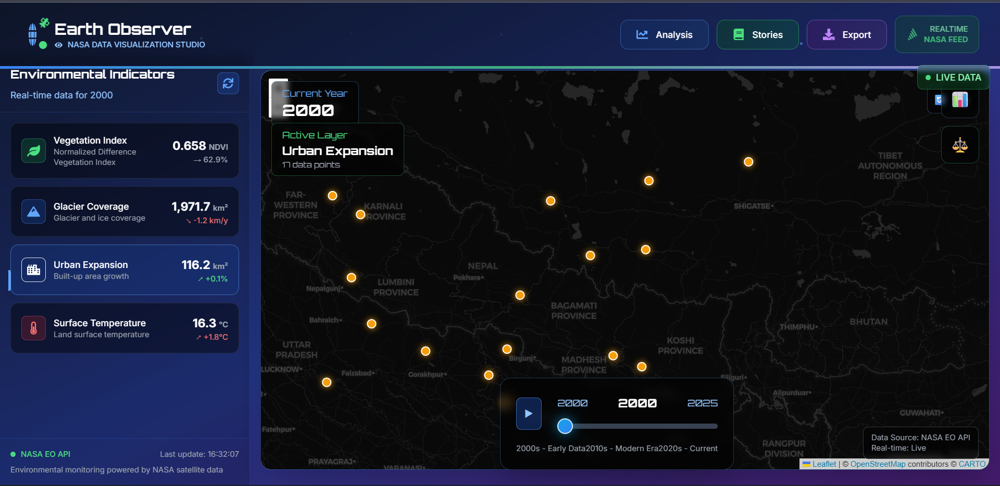

# 🌍 EarthPulse



## ✨ What's EarthPulse?

EarthPulse is my passion project that turns complex NASA Earth observation data into beautiful, interactive visualizations. Ever wondered how our planet's environment changes over time? That's exactly what inspired me to build this tool! It lets you explore everything from vegetation patterns to temperature changes through an intuitive, modern interface.

## 🚀 Why I Built This

I've always been fascinated by environmental data and space technology. EarthPulse combines these interests into a tool that makes NASA's satellite data accessible and meaningful. Whether you're a data enthusiast, environment buff, or just curious about our planet, EarthPulse helps you discover and understand Earth's patterns in a visually engaging way.

## ⭐ Cool Features

- **🗺️ Interactive Maps**: Zoom, pan, and explore Earth observation data with smooth Leaflet integration
- **📊 Environmental Dashboard**: Real-time data analysis with beautiful visualizations
- **⏳ Time Machine**: Slide through history to see how our planet has changed
- **📖 Story Mode**: Turn data into compelling visual stories
- **💾 Easy Exports**: Download your findings in various formats
- **🛰️ NASA API**: Direct connection to NASA's Earth Observation data

## 🛠️ Tech Stack

### Frontend Magic
```
🎨 React 18 + TypeScript - For a robust, type-safe UI
⚡ Vite - Lightning-fast builds
🎭 Framer Motion - Smooth animations
🌐 Leaflet - Interactive mapping
🎯 Zustand - Simple state management
```

### Backend Power
```
🚄 FastAPI - Modern, fast Python web framework
🌍 Geospatial Libraries - For serious data crunching
🔌 NASA API Integration - Direct data pipeline
📦 SQLAlchemy - Solid data management
```

## 📁 Project Structure

```
earthpulse/
├── frontend/
│   ├── src/
│   │   ├── components/
│   │   │   ├── ComparisonTool.tsx
│   │   │   ├── EnvironmentalDashboard.tsx
│   │   │   ├── MapContainer.tsx
│   │   │   └── ...
│   │   ├── services/
│   │   │   └── api.ts
│   │   └── App.tsx
│   ├── package.json
│   └── vite.config.ts
│
├── backend/
│   ├── app/
│   │   ├── routes/
│   │   ├── models/
│   │   ├── services/
│   │   └── utils/
│   ├── requirements.txt
│   └── run_dev.py
│
└── docs/
    └── api-documentation.md
```

## 🏃‍♂️ Want to Run It?

### You'll Need
- Python 3.9+
- Node.js 16+
- PostgreSQL (optional)
- NASA API Key (for real data)

### Quick Start

1. **Clone the repository**
   ```bash
   git clone https://github.com/Aditya-Nepal/Earthpulse.git
   cd Earthpulse
   ```

2. **Backend Setup**
   ```bash
   cd backend
   python -m venv venv
   source venv/bin/activate  # On Windows: venv\Scripts\activate
   pip install -r requirements.txt
   cp env.example .env  # Configure your environment variables
   python run_dev.py
   ```

3. **Frontend Setup**
   ```bash
   cd frontend
   npm install
   cp frontend.env.example frontend.env.local  # Configure your environment variables
   npm run dev
   ```

4. Open [http://localhost:5173](http://localhost:5173) in your browser

## 🎮 Quick Guide

### Exploring Earth Data
1. Pick your environmental indicator (like vegetation or temperature)
2. Use the time slider to travel through years
3. Toggle different data layers
4. Zoom in to areas you're interested in

### Comparing Time Periods
- Hit the compare button to see changes over time
- Select your dates and indicators
- Watch the differences unfold side by side

### Creating Reports
- Choose your data and time range
- Generate beautiful visualizations
- Export in your preferred format

## 📝 Note

This is a personal project built for fun and learning. Feel free to use it, play with it, or modify it for your own explorations! The NASA Earth Observation data integration makes it a great tool for anyone interested in environmental patterns and changes.

---